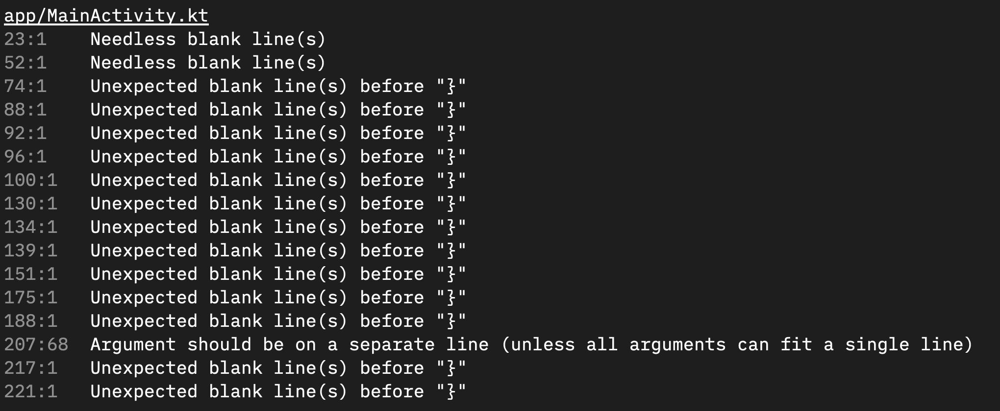

# kozzy

Kozzy is a pretty formatter for ktlint linter output. This project is a ktlint version of [swizzy](https://github.com/sharat/swizzy/), and both the projects are heavily inspired from [snazzy](https://github.com/feross/snazzy)




### Format ktlint as compact and stylish output.

## Usage

```bash
# brew install ktlint

ktlint | npx kozzy
```

