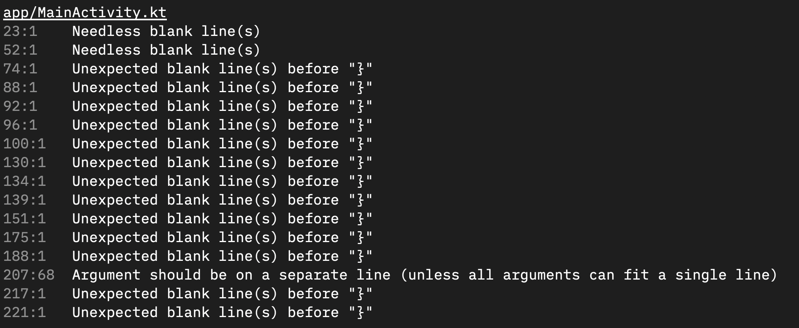

# Kozzy

Pretty formatter for [ktlint](https://pinterest.github.io/ktlint/) output. Compact, stylish, and CI-friendly.



## Features

- **Compact Output** — Groups lint errors by file path
- **Stylish Formatting** — Colored output with line numbers via picocolors
- **Exit Codes** — Returns proper exit codes for CI/CD integration
- **Streaming** — Processes ktlint output in real-time via Node.js streams
- **Zero Config** — Works out of the box with sensible defaults

## Installation

### npm
```bash
npm install -g kozzy
```

### pnpm
```bash
pnpm add -g kozzy
```

### yarn
```bash
yarn global add kozzy
```

### bun
```bash
bun install -g kozzy
```

### npx (no install)
```bash
npx kozzy
```

## Usage

```bash
# Install ktlint first
brew install ktlint

# Pipe ktlint output through kozzy
ktlint | kozzy

# Or use --stdin flag explicitly
ktlint | kozzy --stdin
```

## CLI Options

| Option | Description |
|--------|-------------|
| `--stdin` | Read from stdin explicitly |
| `--help` | Show help message |
| `--version` | Show version number |

## API

```typescript
import { CompactStream } from 'kozzy'

const stream = new CompactStream()
ktlintProcess.stdout.pipe(stream).pipe(process.stdout)
```

## Development

### Install dependencies
```bash
# npm
npm install

# pnpm
pnpm install

# yarn
yarn install

# bun
bun install
```

### Run tests
```bash
# npm
npm test

# pnpm
pnpm test

# yarn
yarn test

# bun
bun test
```

### Run tests with coverage
```bash
npm run test:coverage
```

### Build
```bash
npm run build
```

### Lint
```bash
npm run lint
```

## Package Managers

Kozzy works with all major JavaScript package managers:

| Package Manager | Install | Run Tests |
|----------------|---------|-----------|
| npm | `npm install` | `npm test` |
| pnpm | `pnpm install` | `pnpm test` |
| yarn | `yarn install` | `yarn test` |
| bun | `bun install` | `bun test` |

## License

MIT © Sarath C